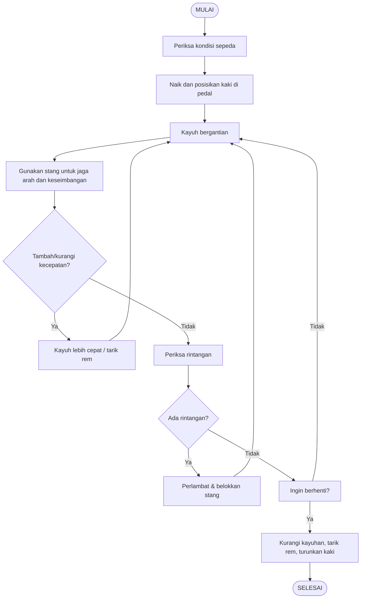

# Technical-Writer

## 1. Cara Mengoperasikan Sepeda Ontel atau Kayuh

A. Pseudocode

// START
1. Periksa kondisi sepeda normal dan bisa digunakan
2. Naik dan duduk di sepeda 
3. Letakkan kaki kanan di pedal kanan atas, kaki kiri tetap di tanah
4. Dorong pedal kanan sambil naikkan kaki kiri ke pedal
5. Kayuh pedal kanan dan kiri bergantian
6. Gunakan stang untuk menjaga arah dan keseimbangan
7. Jika ingin menambah kecepatan maka kayuh lebih cepat
8. Jika ingin mengurangi kecepatan maka kurangi kayuhan atau tarik rem
9. Jika ada rintangan maka kurangi kecepatan dan belokkan stang untuk menghindar
10. Jika ingin berhenti maka kurangi kayuhan, tarik rem perlahan, turunkan kaki ke tanah

// END

B. Flowchart

 ## 2. Pseudocode Algoritma Hitung Luas Kulit Tabung
// START
1. Input tinggi tabung (t)
2. Input jari jari (r)
3. Hitung luas = 2 x π x r x (r + t)
7. Tampilkan Luas
   
// END

 ## 3. Deret Fibonaci diubah Menjadi Pseudocode
 // START
1. Input jumlah deret Fibonacci (n)
2. Tampilkan pesan: "Deret Fibonacci hingga n adalah:"
3. Untuk setiap bilangan i dari 0 sampai n-1:

   a. Jika nilai index ≤ 1 maka hasil = index
   
   b. Jika lebih besar dari 1 maka hasil = jumlah dari dua bilangan sebelumnya
   
   c. Tampilkan hasil ke layar
5. Ulangi sampai seluruh bilangan ditampilkan
  
// END
